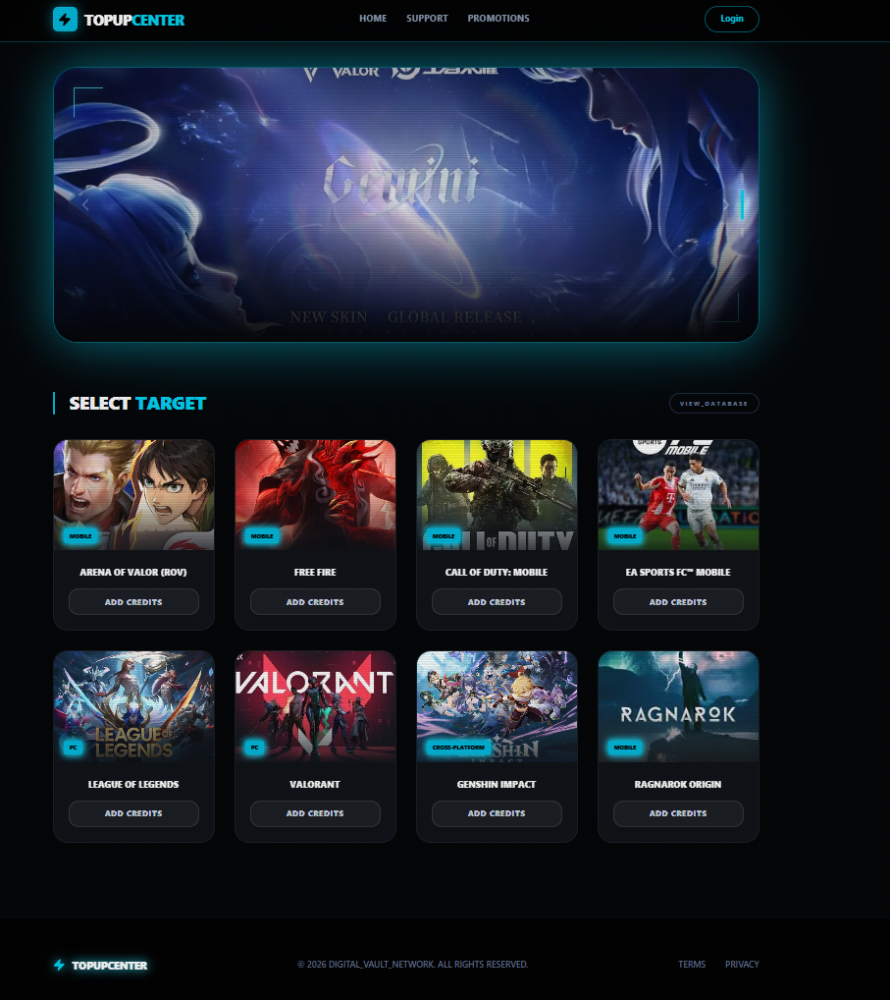

# Cyber Topup Demo

เว็บเดโมร้านเติมเกมสไตล์ cyber dashboard สร้างด้วย Next.js, React, Tailwind CSS และ Supabase สำหรับระบบ auth, ข้อมูลเกม, แพ็กเกจเติมเงิน และประวัติคำสั่งซื้อ



## Features

- หน้าแรกแสดง banner โปรโมชันและรายการเกมจาก Supabase
- Login/Register ด้วย Supabase Auth
- รองรับ Google OAuth ผ่าน Supabase
- Modal สำหรับเลือกเกม, กรอก Player ID, เลือกช่องทางจ่ายเงิน และเลือกแพ็กเกจ
- Mock payment flow พร้อมสถานะคำสั่งซื้อ `pending`, `paid`, `success`, `failed`
- หน้า `/orders` สำหรับดูประวัติคำสั่งซื้อของผู้ใช้ที่ล็อกอิน
- Middleware สำหรับ sync session cookie และ redirect ผู้ใช้ที่ล็อกอินแล้วออกจากหน้า login

## Tech Stack

- Next.js 16
- React 19
- TypeScript
- Tailwind CSS 4
- Supabase SSR/Auth/Database
- Framer Motion
- Lucide React

## Project Structure

```text
app/
  login/        หน้าเข้าสู่ระบบและสมัครสมาชิก
  orders/       หน้าประวัติคำสั่งซื้อ
  page.tsx      หน้าแรกและรายการเกม
components/
  GameCard.tsx  การ์ดเกมและ modal สร้างคำสั่งซื้อ
lib/
  supabase.ts        Supabase client ฝั่ง browser
  supabaseServer.ts  Supabase client ฝั่ง server
public/
  banners/      รูป banner โปรโมชัน
  games/        รูปเกม
supabase/
  orders_demo.sql  SQL สำหรับสร้างตาราง orders demo
```

## Requirements

- Node.js 20 หรือใหม่กว่า
- npm
- Supabase project

## Environment Variables

สร้างไฟล์ `.env.local` ที่ root ของโปรเจค:

```env
NEXT_PUBLIC_SUPABASE_URL=your_supabase_project_url
NEXT_PUBLIC_SUPABASE_ANON_KEY=your_supabase_anon_key
```

ห้าม commit `.env.local` หรือไฟล์ `.env*` ที่มี secret ขึ้น Git

## Supabase Setup

1. สร้าง Supabase project
2. เปิด Email/Password auth ใน Supabase Auth
3. ถ้าต้องการใช้ Google Login ให้ตั้งค่า Google provider ใน Supabase Auth
4. เปิด SQL Editor แล้วรันไฟล์ `supabase/orders_demo.sql`
5. สร้าง/เตรียมตารางข้อมูลเกมและแพ็กเกจให้ตรงกับ query ในหน้าแรก:

```text
games:
  title, category, image_url, currency_name

packages:
  game_id, base_amount, bonus_amount, price
```

หน้าแรก query `games` พร้อม relation `packages (*)`

## Getting Started

ติดตั้ง dependencies:

```bash
npm install
```

รัน dev server:

```bash
npm run dev
```

เปิดเว็บที่:

```text
http://localhost:3000
```

## Available Scripts

```bash
npm run dev      # run development server
npm run build    # build production app
npm run start    # start production server
npm run lint     # run ESLint
```

## Git Notes

ไฟล์ที่ควร commit:

- source code ใน `app/`, `components/`, `lib/`
- assets ใน `public/`
- SQL demo ใน `supabase/`
- config เช่น `next.config.ts`, `tsconfig.json`, `eslint.config.mjs`
- `package.json` และ `package-lock.json`

ไฟล์ที่ไม่ควร commit:

- `.env.local` และไฟล์ `.env*` ที่มี key/secret
- `node_modules/`
- `.next/`
- log, cache และไฟล์ build output
